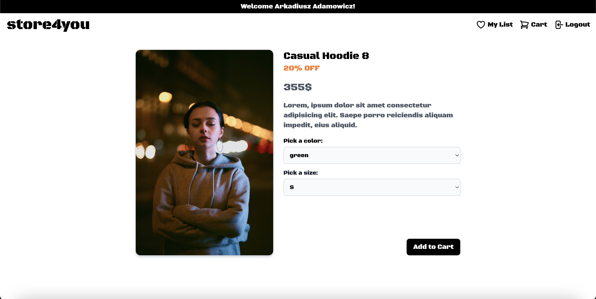
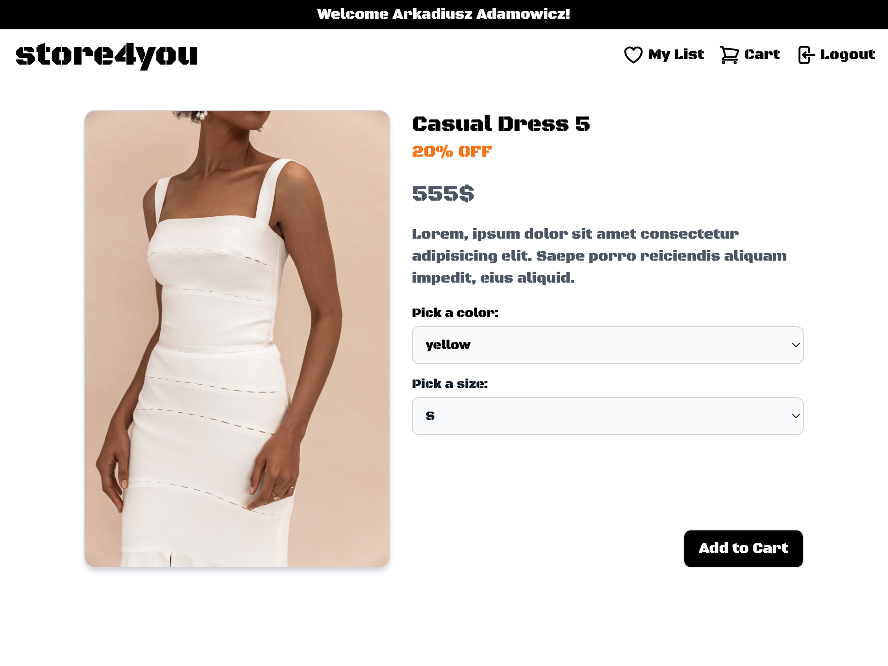
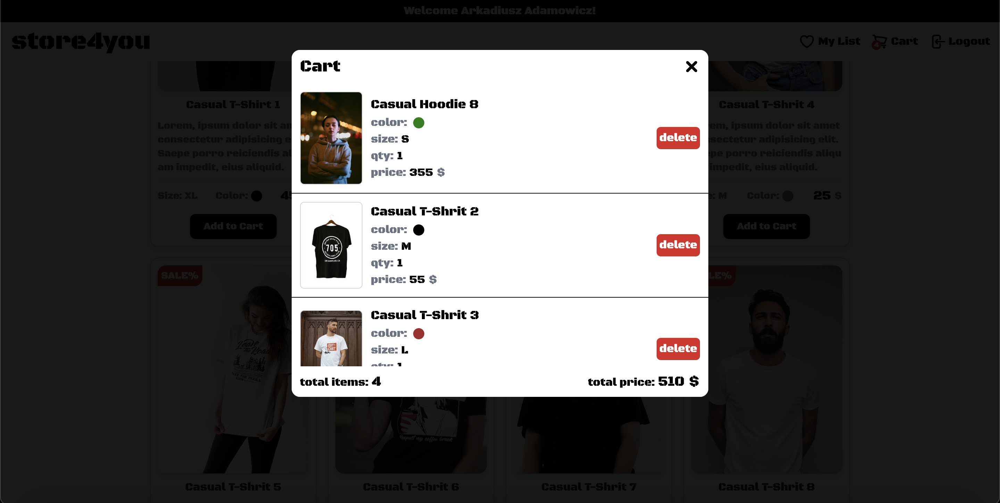

<h2>E-commerce app based on redux-toolkit</h2>
user can:

<ul>
<li>login</li>
<li>select product from list</li>
<li>sort product by price</li>
<li>filter product by gender, color, size</li>
<li>clear selected filters</li>
<li>add item to cart</li>
</ul>

demo:

<h2>https://redux-store-arek.netlify.app</h2>

 

 

 

 
